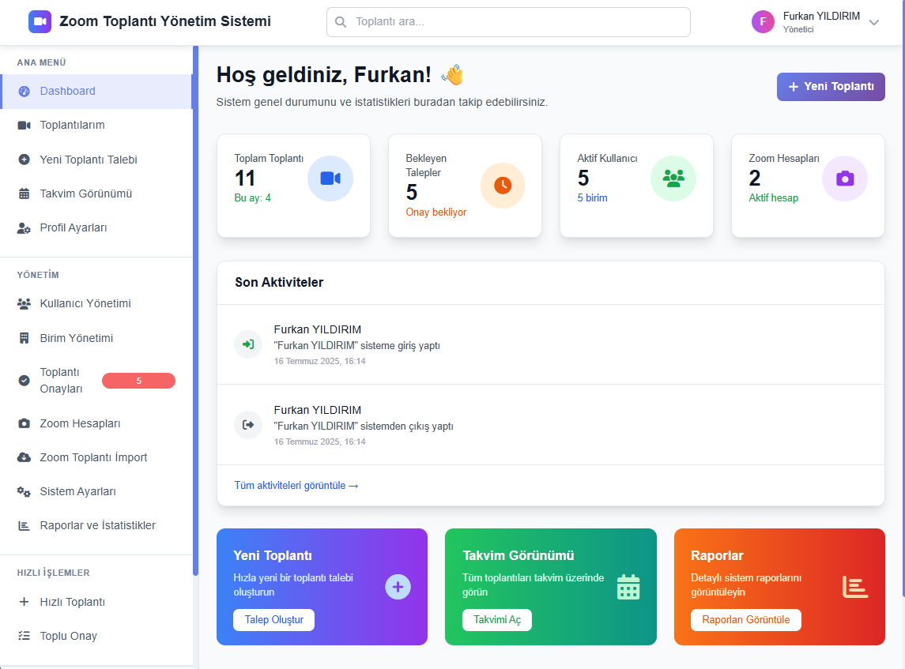

# Zoom Meeting Management System

A comprehensive meeting management platform for corporate environments. The system automates meeting workflows through Zoom Server-to-Server OAuth integration with user requests, admin approvals, multi-account management, reporting, and an extensible module system.



> 🇹🇷 [Türkçe README](README.tr.md) (legacy / translated separately)

---

## Features

### Security
- Session-based authentication with hijacking protection (UA-bound signature, 2h timeout)
- CSRF tokens on every form and POST endpoint
- Role-based access (admin / user)
- bcrypt password hashing
- Login rate limiting (5 attempts / 5 minutes, IP-based)
- `.htaccess` access blocks on `config/`, `logs/`, `includes/`, `data/`

### Meeting Management
- Full Zoom REST API v2 integration (Server-to-Server OAuth)
- Single or bulk approval workflow
- Conflict detection: per user, per department, per Zoom account
- Department-based weekly meeting quotas
- System closure periods (block requests on specific dates)
- Recurring meeting support (occurrence-aware)

### Admin Panel
- Real-time dashboard with charts
- User, department, and invitation-link management
- Multi-Zoom-account orchestration with **best-account auto-selection**
- Detailed reporting with CSV export
- Zoom Cloud recording access

### Database Backup / Restore
- Portable **JSON + ZIP** backups (works between MySQL ↔ SQLite — dialect-agnostic)
- One-click backup / upload-and-restore from the admin panel
- "Restore from backup" mode in the install wizard

### Module System (Plugins)
- WordPress-like **hook/event mechanism** (`addAction` / `addFilter`)
- Modules are filesystem-resident (`modules/<id>/`) — admin UI offers only **activate / deactivate / settings**
- Modules can add their own DB tables, admin pages, API endpoints, and sidebar menu items
- Core hook points: `meeting.after_create`, `meeting.after_approve`, `sidebar.admin_menu`, `sidebar.user_menu`, and more

#### Built-in module: **SMS Notifications**
- Sends an SMS to the administrator when a new meeting request is created
- A **one-time signed token** in the SMS opens an approval page **without login**
- The approval page lists only Zoom accounts that are **conflict-free** for that time slot; the admin picks one and approves
- Works with any generic **form-POST + JSON-response** SMS provider — endpoint and API key are configured via the admin panel (no secrets in the repository)
- Tokens are single-use, expire after a configurable TTL, and validate that the meeting is still pending
- All SMS deliveries are logged

### Multi-language (i18n)
- JSON-based translation catalogues in `lang/<locale>.json`
- Built-in **Turkish (tr)** and **English (en)**
- Locale detection: URL `?lang=XX` → session → cookie → `Accept-Language` → default
- Adding a new language: drop a `lang/<code>.json` file with the same keys
- Language switcher (globe icon) in the header

### UI
- Responsive design (TailwindCSS)
- Light / dark theme (persisted in `localStorage`)
- Font Awesome 6 iconography

---

## Requirements

### Minimum
- PHP 8.0+
- MySQL 5.7+ or SQLite 3
- Apache / Nginx with `mod_rewrite`
- `ZipArchive` and `curl` PHP extensions
- A Zoom **Server-to-Server OAuth** application

### Recommended for production
- PHP 8.2+
- MySQL 8.0+
- HTTPS certificate (mandatory for the SMS passwordless approval flow)

---

## Installation

```bash
git clone https://github.com/fyildirim-debug/Zoom-Meeting-Management.git
cd Zoom-Meeting-Management
# Upload files to your web root
```

Open `http://yourdomain.com/install/` in a browser. The wizard offers two paths:

1. **Fresh install** — DB credentials → admin user → system settings
2. **Restore from backup** — DB credentials → upload `.zip` backup → automatic schema + data import

When installation finishes, the `install/` folder is locked automatically via `.htaccess`.

### File permissions (Linux production)

```bash
chown -R <user>:<group> .
chmod -R 755 .
chmod -R 775 data data/backups logs modules
```

If the web server user is not in your group, use ACLs:

```bash
setfacl -R    -m u:apache:rwx data logs modules
setfacl -R -d -m u:apache:rwx data logs modules
```

SELinux (RHEL/Rocky/Alma):

```bash
chcon -R -t httpd_sys_rw_content_t data logs modules
```

---

## Zoom API setup

1. Create an account at [Zoom Marketplace](https://marketplace.zoom.us/)
2. Create a **Server-to-Server OAuth** app
3. Request the following scopes:
   - `meeting:write:admin`
   - `user:read:admin`
   - `account:read:admin`
4. In the admin panel → **Zoom Accounts** → add a new account with Client ID, Client Secret, and Account ID
5. Use **Test Connection** to verify

Multiple Zoom accounts can be registered; the system automatically picks the first non-conflicting active account when a meeting is approved.

---

## Module development

A module must have at minimum:

```
modules/<module-id>/
├── module.json         # manifest
├── install.php         # creates DB tables, default settings
├── uninstall.php       # cleanup (optional keepData mode)
├── boot.php            # loaded on every request — registers hooks
├── pages/              # admin pages (optional)
├── api/                # JSON endpoints (optional)
└── lib/                # PHP classes (optional)
```

### `module.json`

```json
{
    "id": "my-module",
    "name": "My Module",
    "version": "1.0.0",
    "description": "...",
    "author": "...",
    "settings_url": "pages/settings.php",
    "hooks": ["meeting.after_create"]
}
```

The `id` must match `/^[a-z0-9_\-]{2,64}$/` and match the folder name.

### `boot.php` — registering hooks

```php
HookEngine::addAction('meeting.after_create', function ($meetingId, array $meeting) {
    // Fires when a user creates a meeting request
});

HookEngine::addFilter('sidebar.admin_menu', function (array $items) {
    $items[] = [
        'title' => t('my_module.menu_label'),
        'icon'  => 'fas fa-cog',
        'url'   => url('modules/my-module/pages/settings.php'),
    ];
    return $items;
});
```

### `install.php` — creating tables

```php
return [
    'install' => function (ModuleAPI $api) {
        $api->createTable('module_my_data', [
            'mysql'  => 'CREATE TABLE module_my_data (id INT AUTO_INCREMENT PRIMARY KEY, ...) ENGINE=InnoDB DEFAULT CHARSET=utf8mb4',
            'sqlite' => 'CREATE TABLE module_my_data (id INTEGER PRIMARY KEY AUTOINCREMENT, ...)',
        ]);
    },
];
```

`ModuleAPI::createTable()` is idempotent — if the table already exists it is skipped. Tables created by a module should be prefixed `module_<id>_` by convention.

### Deploying a module

Drop the folder onto the server at `modules/<id>/`, then in **Admin → Modules** click **Activate**. The first activation runs `install.php`; subsequent toggles only flip the active flag (data is preserved).

---

## Project structure

```
├── admin/             # Admin pages (users, meetings, modules, backup, …)
├── api/               # JSON API endpoints
├── config/            # Per-installation configuration (gitignored)
├── data/              # Backups, runtime state (gitignored)
├── includes/          # Core PHP components (ZoomAPI, MeetingService, BackupManager, I18n, …)
├── install/           # Installation wizard
├── lang/              # i18n JSON catalogues (tr, en, …)
├── logs/              # Application logs (gitignored)
├── modules/           # Module system
│   ├── _core/         #   HookEngine, ModuleManager, ModuleAPI, ModuleInstaller, bootstrap
│   └── sms/           #   Built-in SMS module
└── *.php              # User-facing pages
```

---

## Translations

Translation files live in `lang/`:

```
lang/
├── tr.json
└── en.json
```

In PHP templates, use the `t()` helper (or its alias `__()`):

```php
<?= htmlspecialchars(t('sidebar.dashboard')) ?>
<?= htmlspecialchars(t('dashboard.welcome', ['name' => $user['name']])) ?>
```

To add a new locale (e.g. German):

1. Create `lang/de.json` with the same key tree as `tr.json` / `en.json`
2. Add `'de'` to `I18n::SUPPORTED` in `includes/i18n.php`
3. Optionally add a native-name mapping in `I18n::nativeName()`

The user can switch language anytime via the globe icon in the header. The choice is persisted in session + cookie.

---

## Contributing

1. Fork the repository
2. Create a feature branch (`git checkout -b feature/your-feature`)
3. Commit your changes
4. Push the branch (`git push origin feature/your-feature`)
5. Open a pull request

---

## License

MIT License.

**Usage:** Free for non-commercial projects. Commercial use requires a license.

## Maintainer

**Furkan Yıldırım** — [furkanyildirim.com](https://furkanyildirim.com)

## Support

Please open an issue on GitHub Issues for questions and bug reports.
